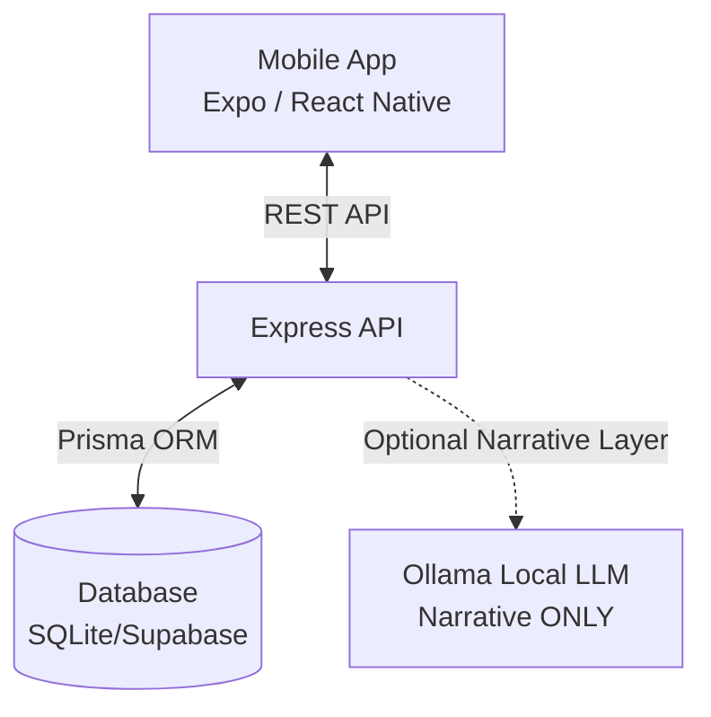
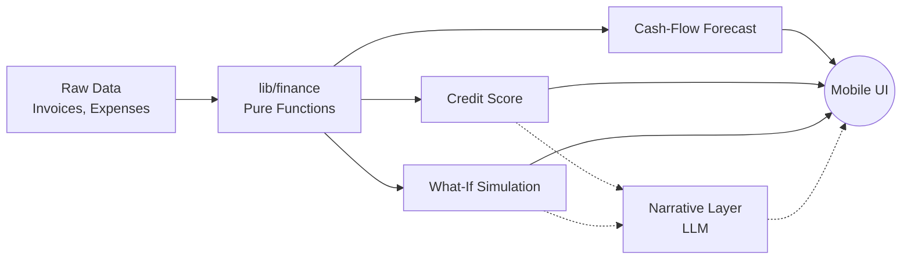

# Vyapaar OS
**AI Financial OS for MSMEs**


*Made for [Insert Hackathon Name Here]*

## 2. 30-Second Pitch
VyapaarOS is an intelligent financial operating system built natively for Indian MSMEs. It transforms raw transactional data into deterministic, explainable financial intelligence, providing real-time credit scoring, runway forecasting, and interactive cash-flow simulations. Unlike generic "AI wrappers", VyapaarOS relies entirely on a deterministic mathematical core to compute numbers—guaranteeing zero fabricated metrics—while utilizing local LLMs solely for generating plain-language narratives.

## 3. Screen Recordings / GIFs
> Record each flow with the device screen recorder and drop the files in docs/media/ using these exact filenames before publishing.

| Screen | Description | Recording |
| --- | --- | --- |
| Login | Secure authentication for demo environments | `` |
| Dashboard | High-level summary of cash, runway, and active alerts | `` |
| Cash Flow | Trailing cash flow forecasts with shortage alerts | `` |
| Invoices | Real-time invoice tracking and overdue highlighting | `` |
| Expenses | Expense tracking and anomalous spend detection | `` |
| Creditworthiness | Deterministic composite risk score and factor breakdown | `` |
| What-If Simulator | Scenario planner to project runway impacts | `` |
| AI Insights | Key trends, repeat rates, and top customer analytics | `` |

## 4. Architecture Overview



**Why a split repository?** 
While initially conceptualized as a monolithic Next.js web application, VyapaarOS is built as a genuine native mobile application utilizing Expo and React Native. This is an intentional architectural adaptation to serve Indian MSMEs, a demographic that is overwhelmingly mobile-first. A dedicated backend ensures that heavy financial computations run securely and consistently across any platform.


*100% deterministic core — LLM only paraphrases, never calculates.*

## 5. Tech Stack

### Mobile
| Layer | Choice | Why |
| --- | --- | --- |
| Framework | Expo SDK 51 | Cross-platform native compilation with rapid iteration. |
| Styling | NativeWind / TailwindCSS | Utility-first styling adapted for React Native. |
| State/Data | React Query + Zustand | Robust async state management and caching. |
| Animation | Moti + Reanimated 3 | High-performance, declarative 60FPS UI animations. |

### Backend
| Layer | Choice | Why |
| --- | --- | --- |
| Server | Express (Node.js) | Lightweight, persistent runtime suitable for heavy calculation. |
| Database | Prisma ORM | Strongly typed schema and simple migration paths. |
| Validation | Zod | End-to-end type safety for API requests. |
| Testing | Vitest | Extremely fast unit testing for mathematical logic. |

## 6. Repository Structure
```text
vyapaaros/
├── backend/
│   ├── prisma/
│   │   └── schema.prisma
│   └── src/
│       ├── lib/
│       │   ├── ai/
│       │   └── finance/
│       ├── app.ts
│       └── server.ts
├── mobile/
│   ├── app/
│   │   ├── (tabs)/
│   │   │   ├── finances/
│   │   │   ├── credit.tsx
│   │   │   ├── dashboard.tsx
│   │   │   ├── insights.tsx
│   │   │   └── simulator.tsx
│   │   └── _layout.tsx
│   ├── src/
│   │   ├── components/
│   │   └── lib/
│   └── eas.json
```

## 7. The Animation System
The UI relies heavily on highly polished, 60FPS micro-interactions using Moti and React Native Reanimated. These physical, tactile interactions build immediate user trust by proving that the numbers are being calculated in real-time, not hardcoded.

### `FadeInView`
- **What it does:** Progressively fades and slides elements up on mount.
- **Under the hood:** Moti `from={{ opacity: 0, translateY: 10 }}` with a spring configuration of `damping: 15, stiffness: 150`.
- **Used in:** Everything. List items in Expenses, ranked cards in Insights, components on the Dashboard.
```tsx
export function FadeInView({ children, delay = 0, className = '' }: FadeInViewProps) {
  return (
    <MotiView
      from={{ opacity: 0, translateY: 10 }}
      animate={{ opacity: 1, translateY: 0 }}
      transition={{ type: 'spring', damping: 15, stiffness: 150, delay }}
      className={className}
    >
      {children}
    </MotiView>
  );
}
```

### `AnimatedNumber`
- **What it does:** Rolls numbers up/down dramatically on mount or value change.
- **Under the hood:** Reanimated `withSpring` interpolating text layout on a shared value.
- **Used in:** Dashboard MetricCards, Creditworthiness composite score, Simulator before/after runway comparison, Insights revenue lists.
```tsx
  useEffect(() => {
    animatedValue.value = withSpring(value, {
      damping: 12,
      stiffness: 90,
      mass: 0.8
    });
  }, [value]);
```

### `PressableScale`
- **What it does:** Shrinks buttons down physically when touched.
- **Under the hood:** `withSpring` scaling on `onPressIn` (0.95 scale) and `onPressOut` (1.0 scale).
- **Used in:** Canned scenario buttons in Simulator, Anomaly drilldown chips in Expenses.
```tsx
  const onPressIn = () => { scale.value = withSpring(0.95); };
  const onPressOut = () => { scale.value = withSpring(1); };
```

### `AnimatedGauge`
- **What it does:** Draws a circular SVG risk gauge starting from 0 and winding up to the credit score.
- **Under the hood:** `react-native-svg` coupled with `Animated.createAnimatedComponent(Circle)` using `strokeDashoffset` and an animated timing function.
- **Used in:** Creditworthiness main score ring.
```tsx
  useEffect(() => {
    Animated.timing(animatedValue, {
      toValue: value,
      duration: 1500,
      useNativeDriver: true,
    }).start();
  }, [value]);
```

**Why animation matters here:** Numbers that visibly count up—and layout elements that smoothly slide into place—reinforce a sense of calculation and intelligence. It implicitly tells the user, "We computed this data just for you right now," cementing the deterministic-core promise.

## 8. Financial Logic Reference
*Every number in the app traces back to one of these functions — none are hardcoded.*

| Function | File | Formula | Div-by-Zero Guard |
| --- | --- | --- | --- |
| Cash Position | `cashPosition.ts` | `inflows - outflows` | N/A |
| Burn Rate | `burnRate.ts` | `(startCash - endCash) / months` | Yes (`months === 0` -> 0) |
| Runway | `runway.ts` | `cash / dailyBurn` | Yes (`dailyBurn <= 0` -> 365+ stable) |
| Overdue Detection | `overdue.ts` | `today - dueDate` | N/A |
| Revenue Consistency | `revenueConsistency.ts` | `mean / stdDev` | Yes (0 / single month -> 100) |
| Payment Behaviour | `paymentBehaviour.ts` | `paidOnTime / totalPaid` | Yes (`totalPaid === 0` -> 100) |
| Cash-Flow Stability | `cashFlowStability.ts` | `monthsPositive / totalMonths` | Yes (`totalMonths === 0` -> 100) |
| Business Continuity | `businessContinuity.ts` | `cash / monthlyExpenses` | Yes (`monthlyExpenses === 0` -> 100) |
| Customer Concentration| `customerConcentration.ts` | `maxCustRev / totalRev` | Yes (`totalRev === 0` -> 0) |
| Anomalous Expense | `anomalousExpense.ts` | `amt > mean + (2 * stdDev)` | Yes (needs >= 2 items) |
| Forecast | `forecast.ts` | Linear Trend projection | N/A |

### Credit Score Weighting
Extracted directly from `creditScore.ts`:
- **Revenue Consistency**: 20%
- **Cash-Flow Stability**: 20%
- **Invoice History**: 15%
- **Payment Behaviour**: 15%
- **Business Continuity**: 15%
- **Customer Concentration**: 15%

**Risk Bands:** 80-100 (Low), 60-79 (Moderate), 40-59 (High), 0-39 (Very High).

### What-If Logic (`whatIf.ts`)
1. **Selection:** Filters unpaid invoices mapped to a specific customer (or all customers for canned scenario).
2. **Perturbation:** Re-models timeline pushing due dates back by `delayDays`.
3. **Risk:** Recalculates projected runway drop percentage to determine impact severity.

## 9. API Reference
| Method | Route | Auth Req | Request Body | Response Shape |
| --- | --- | --- | --- | --- |
| `POST` | `/api/auth/login` | No | `{ username, password }` | `{ token }` |
| `GET` | `/api/dashboard` | Yes | None | `{ cashPosition, runway, burnRate... }` |
| `GET` | `/api/cashflow/forecast` | Yes | Query: `?days=30` | `{ projectedCash[], shortageAlerts[] }` |
| `GET` | `/api/invoices` | Yes | Query: `?status, overdue` | `Invoice[]` |
| `GET` | `/api/expenses` | Yes | None | `{ expenses[], aggregates, anomalies }` |
| `GET` | `/api/credit-score` | Yes | None | `{ score, riskLevel, positiveFactors[], negativeFactors[], explanation, detailedFactors[], narrative }` |
| `GET` | `/api/insights` | Yes | None | `{ topCustomers, categories, repeatRate, trends[] }` |
| `POST` | `/api/simulate/what-if`| Yes | `{ customerId, delayDays }` | `{ risk, currentRunwayDays, scenarioRunwayDays, cashImpact, recommendations, narrative... }` |
| `POST` | `/api/seed` | Dev-Only| None | `{ success, message }` |

## 10. Local Development Setup
1. **Clone the repo** and run workspace install:
   ```bash
   npm install
   ```
2. **Setup Environments:**
   - **Backend** (`backend/.env`):
     - `DATABASE_URL`: Connection string for Prisma (e.g., SQLite file or Postgres URI).
     - `PORT`: 3000 (Backend API port).
     - `SESSION_SECRET`: JWT signing secret.
     - `LLM_PROVIDER`: Set to `none` (fallback templates) or `ollama`.
     - `OLLAMA_ENDPOINT`: API URL if using local LLM.
     - `DEMO_USERNAME` / `DEMO_PASSWORD`: Demo login creds.
     - `SEED_ON_BOOT`: Set to `true` to auto-seed in dev.
   - **Mobile** (`mobile/.env`):
     - `EXPO_PUBLIC_API_URL`: Your backend URL (e.g. `http://<LAN_IP>:3000`).

3. **Database Migration and Seeding:**
   ```bash
   cd backend
   npx prisma migrate dev
   npm run seed
   ```
4. **Start Servers:**
   ```bash
   npm run dev:backend
   npm run dev:mobile
   ```
> **Common Snag:** Ensure `EXPO_PUBLIC_API_URL` uses your machine's physical LAN IP (e.g., `192.168.1.5`), not `localhost`, otherwise the Expo Go app on your phone will not be able to connect to the API!

## 11. Testing
The backend logic is 100% unit-tested via Vitest. To run the suite:
```bash
cd backend
npm run test
```

Mobile UI end-to-end smoke testing is implemented via Maestro (`mobile/.maestro/smoke.yaml`). With your app open in an emulator, run:
```bash
cd mobile
maestro test .maestro/smoke.yaml
```

## 12. Deployment
- **Database:** Supabase free-tier Postgres database provisioned.
- **Backend:** Express API deployed on Render/Railway. `DATABASE_URL` pointing to Supabase.
- **Mobile Builds:** Handled via Expo Application Services (EAS). `eas.json` is configured with `development` (LAN) and `preview` (Render) API endpoints.

## 13. Environment Variables Reference
| Variable | Required | Example | Description |
| --- | --- | --- | --- |
| `DATABASE_URL` | Yes | `file:./dev.db` | Prisma database connection string. |
| `PORT` | No | `3000` | Backend API port. |
| `SESSION_SECRET` | Yes | `super-secret` | JWT signing key. |
| `LLM_PROVIDER` | No | `none` | Toggles Ollama connection vs Fallback templates. |
| `OLLAMA_ENDPOINT` | No | `http://localhost:11434` | Ollama API endpoint. |
| `DEMO_USERNAME` | No | `demo` | Demo account login ID. |
| `DEMO_PASSWORD` | No | `demo` | Demo account login Pass. |
| `EXPO_PUBLIC_API_URL` | Yes | `http://192.168.1.5:3000` | App network routing. |

## 14. Known Gaps / Explicitly Out of Scope
To ensure credibility and adhere strictly to scope boundaries, the following original PRD items were excluded:
- **CSV Data Import**: Skipped. The application relies entirely on the internal seeding mechanism to populate realistic historical transactions for demos.
- **Dark Mode**: Explicitly omitted to focus strictly on layout polishing and 60FPS fluid animations.
- **Multi-tenant Production Ready Auth**: We utilize a hard-coded demo authentication token flow designed solely for hackathon presentation environments.
- **External Bank Sync**: Not implemented. All transactions represent "already recorded" internal system states.

## 15. Hackathon Demo Script
**Step 1:** (Launch) Log into the app, asserting the snappy, fluid Shimmer loaders masking the network calls.
**Step 2:** (Dashboard) Point out the high-level Runway and Cash metrics utilizing `AnimatedNumber` to roll into place. 
**Step 3:** (Cash Flow) Navigate to the Cash Flow tab to display the upcoming 90-day predictive shortage alerts.
**Step 4:** (Invoices) Tab over to Invoices, pointing out the red overdue tags generated purely from the mathematical core.
**Step 5:** (Credit) Navigate to the Creditworthiness tab. Let the `AnimatedGauge` dramatically wind up to the score. Point to the sub-factors.
**Step 6:** (Simulator) Run the canned "What-if my largest customer delays 30 days" scenario. 
**Step 7:** (Drill Down) Tap a simulator recommendation card and open the `DataDrilldown` bottom-sheet to prove the algorithm cites real source Invoice IDs.
**Step 8:** (Resilience) Toggle your network to "Offline" or manually flip the LLM provider to `none` in the backend, proving that the localized deterministic fallback narrative engine runs flawlessly.

## 16. License
[Insert License Here]

---
*Last updated: September 2026. Documenting Phase 21 finalization.*
